# 📱 FIAP Labs

Checkpoint 2: **Mobile Development & IoT**

---

## 🎯 Sobre o Projeto

O **FIAP Labs** é um app mobile que permite ao aluno:

- 🔐 Criar conta e fazer login com seu RM e senha
- 🔍 Ver em tempo real quais laboratórios e salas estão livres ou ocupados
- 🔎 Buscar laboratórios por nome, andar ou equipamento em tempo real
- 📋 Consultar detalhes de cada espaço (capacidade, andar, equipamentos disponíveis)
- 📅 Reservar um horário específico com calendário visual
- 📌 Acompanhar suas reservas ativas e cancelá-las quando necessário
- 👤 Gerenciar perfil com foto, dados do aluno e histórico completo de reservas

### Funcionalidades implementadas

- ✅ Tela de Cadastro com validação de Nome, RM, Senha e Confirmação de Senha
- ✅ Tela de Login com validação de RM e Senha
- ✅ Persistência de usuários e sessão com AsyncStorage
- ✅ Logout com limpeza de sessão e retorno à tela de login
- ✅ Navegação protegida (rotas autenticadas vs. públicas)
- ✅ Listagem de laboratórios com filtro por status (todos / livres / ocupados)
- ✅ Busca em tempo real por nome, andar, equipamento e descrição
- ✅ Tela de detalhes do laboratório com informações completas
- ✅ Calendário visual para escolha de data na reserva
- ✅ Fluxo de reserva com seleção de data, horário e resumo antes da confirmação
- ✅ Reservas persistidas por usuário no AsyncStorage
- ✅ Tela "Minhas Reservas" com cancelamento e confirmação por alerta
- ✅ Tela de sucesso após confirmação de reserva
- ✅ Estado vazio em listas sem dados
- ✅ Tela de Perfil com foto (câmera ou galeria), dados do aluno e histórico de reservas

---

## 👥 Integrantes do Grupo

| Nome | RM |
|---|---|
| Marcos Vinicius da Silva Costa | 555490 |
| Rafael Federici de Oliveira | 554736 |

---

## 🚀 Como Rodar o Projeto

### Pré-requisitos

- [**Node.js**](https://nodejs.org/)
- **Expo Go** ([Android](https://play.google.com/store/apps/details?id=host.exp.exponent) / [iOS](https://apps.apple.com/app/expo-go/id982107779)) ou [**Android Studio**](https://developer.android.com/studio?hl=pt-br)
- Expo SDK 51

### Passo a passo

```bash
# 1. Clone o repositório
git clone https://github.com/yRaffa/fiap-mdi-cp2-labs-app.git

# 2. Entre na pasta
cd fiap-mdi-cp2-labs-app

# 3. Instale as dependências
npm install

# 4. Rode o projeto
npx expo start
```

---

## 📸 Demonstração

### Telas do app

| Login | Cadastro |
|---|---|
|  | 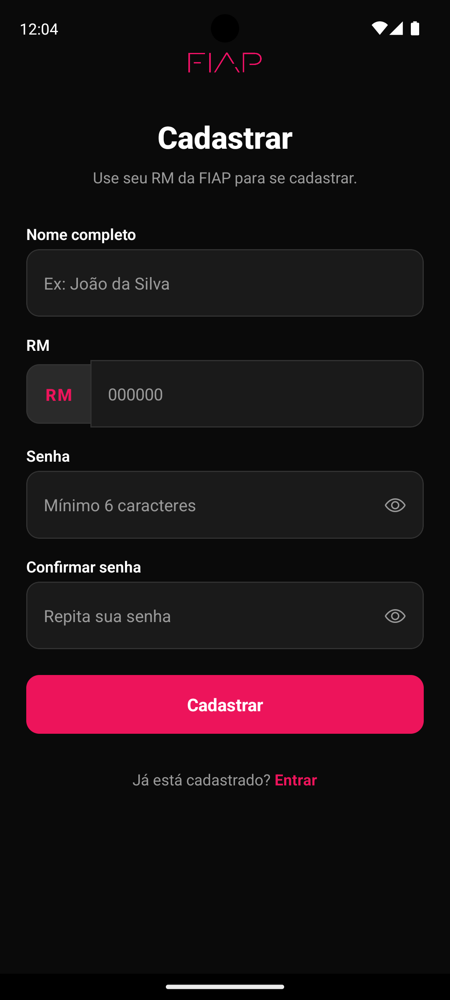 |

| Home | Lista de Labs |
|---|---|
| 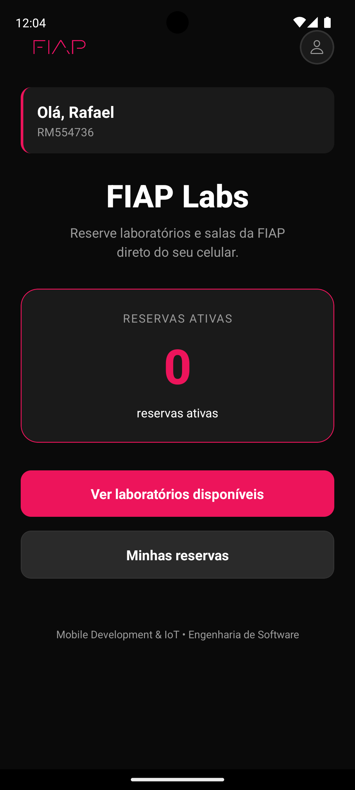 | 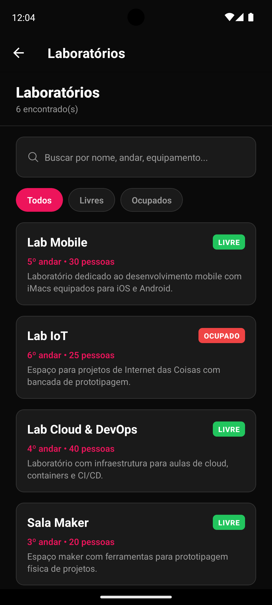 |

| Busca em Tempo Real | Detalhes do Lab |
|---|---|
| 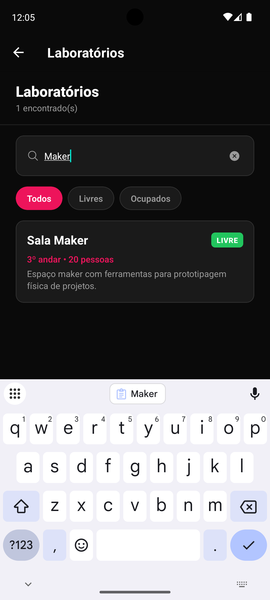 | 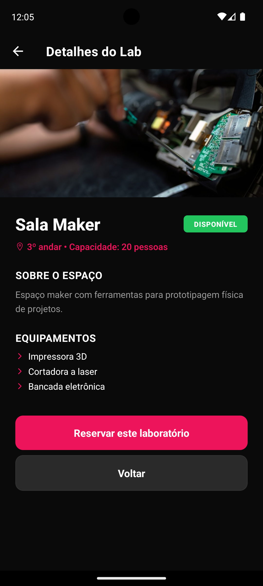 |

| Reservar (Calendário) | Confirmação |
|---|---|
| 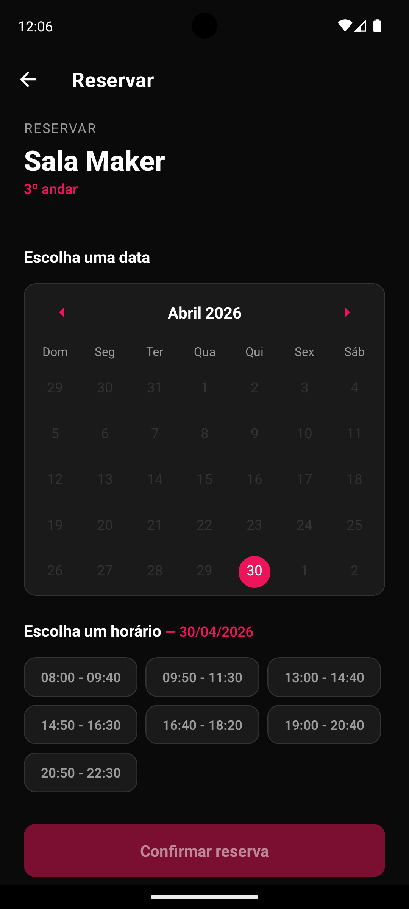 | 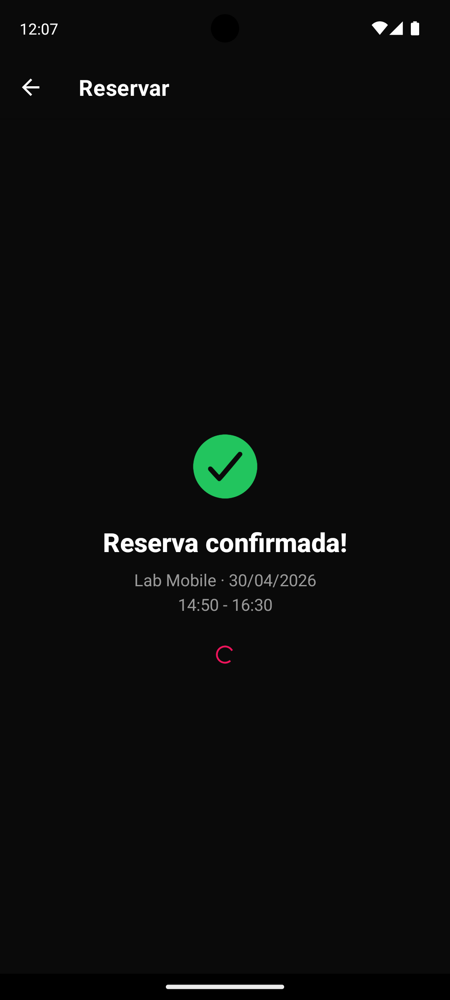 |

| Minhas Reservas | Sem Reservas |
|---|---|
| 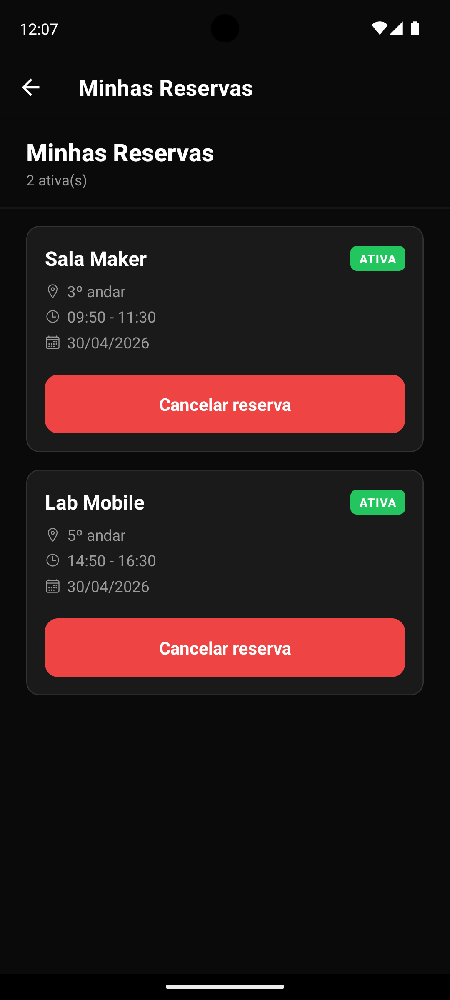 | 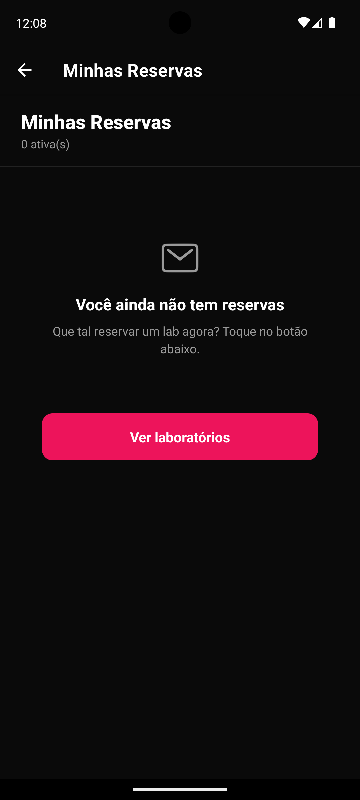 |

| Perfil | Perfil (Histórico) |
|---|---|
| 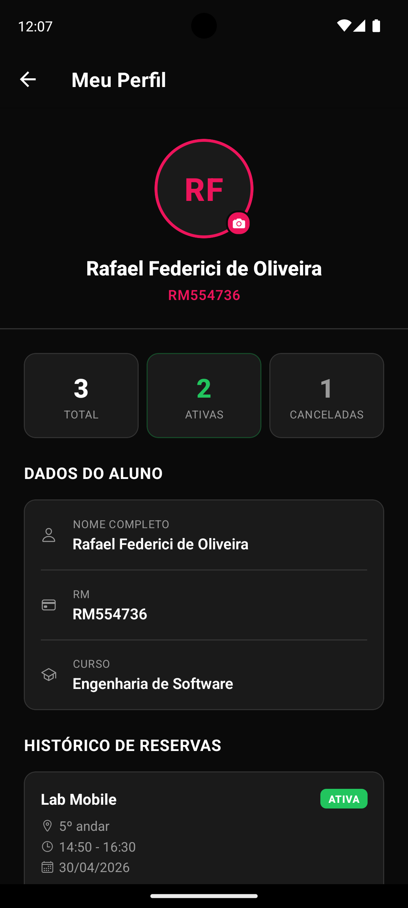 | 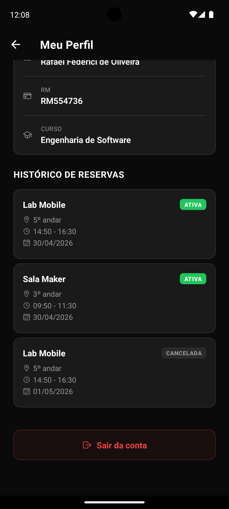 |

---

<div align="center">
    <h3>Vídeo Demonstrativo</h3>
    
</div>

---

## 💻 Decisões Técnicas

A separação por pastas (`components`, `context`, `constants`, `data`) garante que **nenhum arquivo concentre toda a lógica**, atendendo ao requisito de componentização. Cada parte tem uma responsabilidade clara.

### Estrutura de pastas

```
/
│    
├── app/
│    │
│    ├── (auth)/ → Rotas públicas (acessíveis sem login)
│    │    ├── _layout.js
│    │    ├── login.js
│    │    └── cadastro.js
│    │
│    ├── (app)/ → Rotas protegidas (exigem login)
│    │    ├── _layout.js
│    │    ├── index.js
│    │    ├── labs.js
│    │    ├── minhas-reservas.js
│    │    ├── perfil.js
│    │    ├── lab/[id].js
│    │    └── reservar/[id].js
│    │
│    └── _layout.js → Layout raiz (AuthProvider + NavigationGuard)
│
├── assets/ → Imagens e logos
│   
├── components/ → Botao, CardLab, CabecalhoTela, EstadoVazio
│
├── constants/
│    └── theme.js → cores, espaçamentos, bordas
│
├── context/
│    ├── AuthContext.js → Usuário logado, login, logout, cadastro, foto de perfil
│    └── ReservasContext.js → Reservas ativas e histórico por usuário
│
└── data/
     └── labs.js → dados mock dos laboratórios
```

### Hooks utilizados

| Hook | Onde | Para quê |
|---|---|---|
| `useState` | Telas de auth, `labs.js`, `reservar/[id].js`, `perfil.js` | Campos de formulário, erros, estados de loading, data e horário selecionado |
| `useEffect` | `AuthContext.js`, `ReservasContext.js`, `labs.js` | Restaurar sessão ao iniciar, carregar reservas do AsyncStorage, simular loading dos labs |
| `useContext` (via `useAuth`, `useReservas`) | Todas as telas do app | Acessar dados globais de autenticação e reservas sem prop drilling |
| `useMemo` | `labs.js` | Recalcular a lista filtrada/buscada apenas quando `labs`, `filtro` ou `busca` mudam |
| `useRouter` / `useLocalSearchParams` | Várias telas | Navegação programática e leitura de parâmetros de rota |
| `useSegments` | `_layout.js` | Detectar em qual grupo de rotas o usuário está para aplicar a lógica de proteção |

### Contexts criados

**`AuthContext`** — gerencia o ciclo completo de autenticação:
- `usuario` — objeto `{ id, nome, rm, fotoUri }` do usuário logado, ou `null`
- `carregando` — `true` enquanto restaura a sessão do AsyncStorage na abertura do app
- `cadastrar({ nome, rm, senha })` — valida unicidade do RM, salva na lista de usuários, já faz login
- `login({ rm, senha })` — valida credenciais contra o AsyncStorage, salva sessão
- `logout()` — remove sessão do AsyncStorage, reseta o estado
- `atualizarFoto(uri)` — persiste a nova foto no usuário e na sessão ativa

**`ReservasContext`** — gerencia as reservas do usuário logado:
- `reservas` — array com as reservas ativas no momento
- `historico` — array completo de todas as reservas, incluindo canceladas
- `adicionarReserva(dados)` — cria com ID e timestamp, persiste em `reservas` e `historico`
- `cancelarReserva(id)` — remove de `reservas` e marca como `cancelada` no `historico`
- Dados isolados por usuário via chave `@fiaplabs:reservas:{userId}` e `@fiaplabs:historico:{userId}`

### Como a autenticação foi implementada

1. No cadastro, o usuário é salvo em `@fiaplabs:usuarios` no AsyncStorage
2. No login, as credenciais são validadas contra essa lista
3. Após login bem-sucedido, a sessão é salva em `@fiaplabs:sessao`
4. Na abertura do app, `AuthContext` lê `@fiaplabs:sessao` e restaura o estado automaticamente
5. O `NavigationGuard` no `_layout.js` redireciona para login se não há sessão ativa

### Como o AsyncStorage foi utilizado

| Chave | Tipo | Conteúdo |
|---|---|---|
| `@fiaplabs:usuarios` | Array | Todos os usuários cadastrados (id, nome, rm, senha, fotoUri) |
| `@fiaplabs:sessao` | Objeto | Dados do usuário logado (id, nome, rm, fotoUri) |
| `@fiaplabs:reservas:{userId}` | Array | Reservas ativas do usuário, isoladas por ID |
| `@fiaplabs:historico:{userId}` | Array | Histórico completo de reservas com status (ativa/cancelada) |

### Navegação

A navegação foi implementada com **Expo Router** (file-based routing) usando **Route Groups**:

- `(auth)` → rotas públicas: `/login`, `/cadastro`
- `(app)` → rotas protegidas: `/`, `/labs`, `/lab/[id]`, `/reservar/[id]`, `/minhas-reservas`, `/perfil`

O `NavigationGuard` no `_layout.js` raiz monitora `usuario` e `segments` via `useEffect`. Se o usuário não está logado e tenta acessar `(app)`, é redirecionado para `/(auth)/login`. Se já está logado e acessa `(auth)`, é redirecionado para `/(app)`.

### Estilização

Toda a estilização é feita com `StyleSheet.create()`. As cores, espaçamentos e raios estão centralizados em `constants/theme.js`, criando um design system que garante consistência visual em todas as telas.

---

## ⭐ Diferencial

FlatList com campo de busca e filtro dinâmico por texto.

**Como foi implementado:**
- `TextInput` na tela de laboratórios, acima dos chips de filtro
- Busca case-insensitive por nome, andar, descrição e array de equipamentos
- `useMemo` para recalcular `labsFiltrados` apenas quando `labs`, `filtro` ou `busca` mudam (performance)
- Busca combinada com filtro de status de forma independente
- Ícone de limpar (`close-circle`) que aparece quando há texto digitado
- Mensagem de estado vazio customizada quando a busca não retorna resultados

---

## 👀 Próximos Passos

Com mais tempo de desenvolvimento, poderia ser implementado:

- 🔒 **Expo SecureStore** para armazenar a senha de forma criptografada
- 🔔 **Notificações locais** com Expo Notifications (lembrete antes do horário reservado)
- 🌐 **Integração com API REST** para persistência no backend
- 🌙 **Modo escuro/claro** com alternância pelo usuário via Context

---
